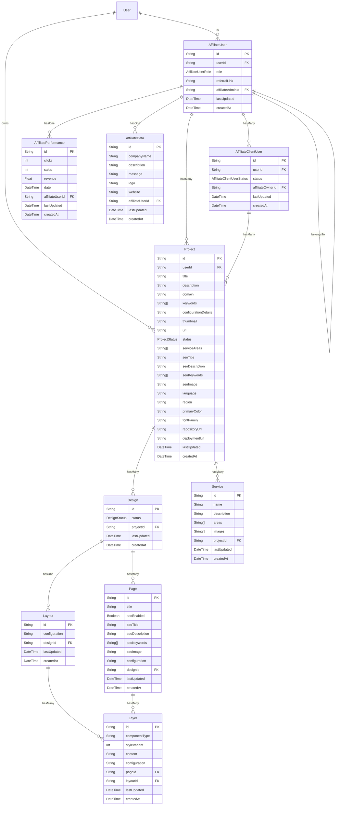

# enJerneering UI Builder

## Overview

`enJerneering UI Builder` is an AI-powered drag-and-drop project builder for websites and web applications, designed to help you get to market faster. Our intuitive platform empowers you to design, preview, iterate, and launch with state-of-the-art interface builder. Own your code forever, created in modern powerful technologies that utilize server infrastructure for powerful performance!

## Data Model

## API Endpoints

Access the API by running the application and routing to HOSTNAME[:PORT]/api-docs.

## Getting Started

### Installation:

1. Ensure you have the latest version of Node.js and npm installed.
2. Install the enJerneering UI Builder via your Git manager.
3. Ensure .env is added to the root of this project.
4. From the terminal, run 'npm i' to install dependencies, then 'npm run dev' to start the server.

## License

This software is privately licensed by enJerneering LLC.

## Changelog

For the list of recent changes, see the CHANGELOG file.

enJerneering UI Builder © enJerneering LLC. All rights reserved.
